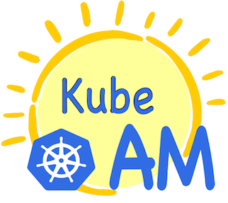
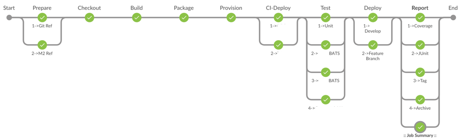

Kubernetes Application and Workflow manager

Integrates directly with your CI (Jenkins BO/CircleCI/Bamboo) and allows you to have end to end CI/CD.




### TODO:


- [x] We need to Add available cluster detection to kubeAM. Redis (not fully featured yet)
- [ ] Add samples of Jenkinsfile and circle.yaml
- [ ] Add TLS mutual cert auth. If possible add suport for multiple certs validation (one per account)
- [ ] Add Logic to parse application.json and return in structure. This will drive the logic of each rest endpoint.
- [ ] convert from using kubectl to cliento-go For better error handling, retry with backoff and return information to caller rest endpoint. We have a PR for this need input on pros and cons on doing client-go way.
- [x] Better build system. Look at isakconf for a sample.
- [ ] Reporting of cluster aviability.
- [x] getStatus should loop for each resource and generate a report. Right now is issuing a single call. If one resource is missing. Causes report to fail.
- [x] Health-check of kubeam     
- [x] Add support for includes to templates. This is needed for suporting source CIDR restrictions. 
- [x] Switch to go template from fast-template
- [ ] Rename provision api to something with more meaning is supposed to be endpoint for resources that timeout.
- [ ] Make /v1/provision work with generic applications using api.yaml file
- [ ] make /v1/waitforready generic driven by api.yaml
- [ ] Remove self-deploy endpoint. Now it can self deploy using api.yaml just like any other app.
- [ ] /v1/waitforready should look for multiple resources and wait for all of them. This is for complex applications

## Requirements

| Requirement | URL |
|-------------|----|
| Go | https://golang.org/doc/install |
| Docker | https://docs.docker.com/install/ |
| go/simplejson | go get github.com/bitly/go-simplejson |
| go/kubernetes | go get k8s.io/client-go/... |
| go/godep | go get github.com/tools/godep |
| go/mux | go get -u github.com/gorilla/mux |

## Setup

```bash
cd {path to kubeAM}
bash download-kubectl.sh
make package
docker push localhost:5000/kubeam
```
==
```bash
cd /{path to kubeAM}/demo
bash minikube-setup.sh
source set-registry.sh
kubectl apply -f kubeam-bootstrap-pod.yaml && kubectl apply -f kubeam-bootstrap-service.yaml
curl -k $(minikube service kubeamservice --format "https://admin:123456@{{.IP}}:{{.Port}}" --url)/health-check
curl -X POST -k $(minikube service kubeamservice --format "https://admin:123456@{{.IP}}:{{.Port}}" --url)/v1/create/kubeam/minikube/main/latest
```

# API
[RAML Spec](/kubeam.raml)

```yaml
#%RAML 1.0
title: kubeAM
version: 1
securitySchemes: 
  basic:
    type: Basic Authentication
/:
  get:
    responses:


/health-check: # optional resourc
  get: # HTTP method declaration
    responses: # declare a response
      200: # HTTP status code
        body: # declare content of response
          application/text: # media type
            type: | # structural definition of a response (schema or type)
              {
                "title": "Hello world Response",
                "type": "object",
                "properties": {
                  "message": {
                    "type": "string"
                  }
                }
              }
            example: | # example of how a response looks
              {
                "message": "OK"
              }


/v1/create:
  /{application}/{environment}/{cluster}/{tag}:
    description: Create a brand new cluster
    post:
      responses: 
        200:
          body: 
            application/json:
              example: |
                {
                  "action": "create",
                  "resourcce": "qbo-qa-c76"
                }
            application/text:
              example: "Application not found"


/v1/provision:
  description: Recreates (Delete then create) a resource using cluster selector
  /self/{environment}/{tag}:
    description: Self deployment
    post:
      responses:
        200:
          body:
            application/text:
              example:
    push:
      responses:
        200:
          body:
            application/text:
              example:

  /{application}/{environment}/{cluster}/{tag}:
    post:
      description: Creates an ephemeral kubernetes resource
      responses: 
        200:
          body: 
            application/json:
              example: |
                {
                  "action": "create",
                  "resourcce": "qbo-qa-c76"
                }
            application/text:
              example: "Application not found"
    delete:
      description: Delete the kubernetes resource
    get:
      description: Gets status of a cluster
      responses: 
        200:
          body: 
            application/json:
              example: |
                {
                  "resourcce": "qbo-qa-c76-app"
                  "namespace": default
                }
            application/text:
              example: "Application not found"
  /{application}/{environment}/{cluster}/{tag}/{ttl}:
    description: Delete resource
    patch:
      response:
        200:
          body:
            application/json:
              example: |
                {
                  "action": "deleted",
                  "resourcce": "qbo-qa-c76-app",
                  "namespace": default
                }

/v1/deploy:
  /{application}/{environment}/{cluster}/{tag}:
    post:
      description: Updates the kubernetes resource for the given parameters


/v1/listclusters:
  description: List active clusters from Redis
  /{application}/{environment}:
    get:
      responses: 
        200:
          body: 
            example: ["76", "82", "16"]


/v1/getclusterdetails:
  description: Get detail on running cluster
  /{application}/{environment}/{cluster}:
    get:


/v1/getallclusterdetails:
  description: Get detail on all running clusters
  /{application}/{environment}:
    get:


/v1/waitforready:
  description: Wait for resource to be active`
  /{application}/{environment}/{cluster}:
    get:


/v1/event:
  /{application}/{environment}/{cluster}/{tag}:
    post:
      description: Parses and saves the event payload to database
      body: 
        application/json:
          example: |
            {
              "event": "create",
              "message": "git checkout complete",
              "timestamp": 12 AM,
              "pipeline: kubeam
            }


/v1/kubejob:
  /{application}/{environment}/{cluster}/{jobname}:
    post:
      description: Creates a kubernetes job object
      body:
        application/json:
          example: |
            {
              "jobcommand": /bin/bash,
              "jobparams": sleep,
            }
      responses:
        200:
          body: 
            application/json:
              example: |
              {
                "action": ,
                "resourcce": ,
                "namespace": ,
              }
    get:
      description: Get execution status of an existsing kubernetes job
      responses: 
        200:
          body: 
            application/json:
              example: |
                {
                  "Jobname": ABC,
                  "JobID": 123124,
                  "Starttime": ,
                  "LastProbeTime": ,
                  "JobStatus": Running,
                  "Logs": ,
                }
    delete:
      description: Delete a kubernetes job
      responses: 
        200:
          body: 
            application/xml:
              example: Job {app}-{env}-c{cluster}-{name} deleted          


/featurecluster:
  /{application}/{environment}/{branch}:
    post:
      description: Reserver a cluster for a specific feature branch
      response:
        200:
          body:
            application/text:
              example: |
                "Cluster 75 allocated"
    get:
      description: Retrieve the TTL for reserved feature cluster
      response:
        200:
          body:
            application/text:
              example: |
                "6324 seconds"
    delete:
      description: Delete a previously reserved cluster


/v1/githubhook:
  post:
    description: Parses the payload to checkout the github repository into applications
    body: 
      application/json:
        example: |
          {
            "zen": "Approachable is better than simple.",
            "hook_id": 33892538,
            "hook": {
              "type": "Repository",
              "id": 33892538,
              "name": "web",
              "active": true,
              "events": [
                "*"
              ],
              "config": {
                "content_type": "json",
                "secret": "{.secret}",
                "url": "{.kubeam-url}"
              },
              "updated_at": "2018-06-19T17:03:48Z",
              "created_at": "2018-06-19T17:03:48Z",
              "url": "https://api.github.com/repos/{.repo}",
              "last_response": {
                "code": null,
                "status": "unused",
                "message": null
              }
            },
            "repository": {
              "id": 137921078,
              "name": "yamler",
              "full_name": "samkeet/yamler",
              "owner": {
                "login": "samkeet",
                "id": 25041447,
                "url": "https://api.github.com/users/samkeet",
              },
            },
            "sender": {
              "login": "samkeet",
              "id": 25041447,
            }
          }
    responses:
      200:
        body: 
          application/text:
            example: Success
  put:
    description: "Downloads and checks out all repositories stored in database"
    responses: 
      200:
        body:
          application/text:
            example: ["githubrepo_1", "githubrepo_2"]
```

#### Tags
```
PAYLOAD="
{
   name: "BATS-OK",
   msg: "PASSED QBO-BATS",
   ts: "2018-01-01 01:01:01"
}
curl -X POST -k https://admin:${SECRET}@{.kubeam-url}:443/v1/settag/QBO/QA/66/{docker-TAG}

KEYS are:  <APPLICATION>/<ENVIRONMENT>/<SHARD>/<DOCKER-TAG>
```

Permanently remove a cluster definition (sporadicaly used)

### AWS Enpoint:
`https://<account:password>@{.kubeam-url}:443...`


